<!-- ═══════════════════════════════════════════════════════════════════ -->
<!--               ✦  ANIMATED HEADER BANNER  ✦                        -->
<!-- ═══════════════════════════════════════════════════════════════════ -->

<div align="center">




</div>

<!-- ─── SKILL ICON TICKER ─────────────────────────────────────────────── -->
<div align="center">

</div>

<br/>

<!-- ─── TYPING ANIMATION ──────────────────────────────────────────────── -->
<div align="center">


</div>

<br/>

<!-- ─── BADGE ROW ───────────────────────────────────────────────────────── -->
<div align="center">

[](https://github.com/ShubhasmitaVLSI)
[](https://www.linkedin.com/in/shubhasmita-sahoo-724185137)
[](https://github.com/ShubhasmitaVLSI)
[](https://www.linkedin.com/in/shubhasmita-sahoo-724185137)

</div>


---

<!-- ═══════════════════════════════════════════════════════════════════ -->
<!--                   VERIFICATION SNAPSHOT                           -->
<!-- ═══════════════════════════════════════════════════════════════════ -->

## 🔬 Verification Snapshot

```text
┌─────────────────────────────────────────────────────────────┐
│  DESIGN VERIFICATION ENGINEER — SHUBHASMITA SAHOO           │
│  handle      │  ShubhasmitaVLSI                             │
├──────────────┬──────────────────────────────────────────────┤
│  role        │  R&D Senior Engineer · Design Verification   │
│  company     │  Synopsys · Bangalore                        │
│  domain      │  Testchip DV · SoC / IP DV · VLSI            │
│  experience  │  4.2+ years — RTL · GLS · UVM · automation   │
│  methodology │  SystemVerilog · UVM · SVA · Coverage-driven │
│  platforms   │  VCS · Verdi · Primetime · Emulation         │
│  signoff     │  GLS-SDF · PG-GLS · UPF · Coverage closure   │
├──────────────┼──────────────────────────────────────────────┤
│  strengths   │  Testchip verification · IP integration      │
│              │  UVM · coverage closure · GLS · automation   │
│  also        │  Hardware Emulation — BMOD · hybrid flows    │
├──────────────┼──────────────────────────────────────────────┤
│  education   │  M.Tech VLSI (KIIT) · B.Tech EIE (NIT R)     │
│  seeking     │  Design Verification · Bangalore / Hybrid    │
├──────────────┴──────────────────────────────────────────────┤
│  ●  ACTIVE — Verifying · Emulating · Closing Coverage       │
└─────────────────────────────────────────────────────────────┘
```

---

<!-- ═══════════════════════════════════════════════════════════════════ -->
<!--                   VERIFICATION IMPACT                             -->
<!-- ═══════════════════════════════════════════════════════════════════ -->

## 📊 Verification Impact

<div align="center">

<table>
<tr>
<td align="center" width="220">

<br/><br/>
<sub>RTL / IP integration · functional DV · coverage · GLS</sub>
</td>
<td align="center" width="220">

<br/><br/>
<sub>Feature plans · functional & code coverage</sub>
</td>
<td align="center" width="220">

<br/><br/>
<sub>GLS · PG-GLS · GLS-SDF · setup/hold · X-prop</sub>
</td>
<td align="center" width="220">

<br/><br/>
<sub>Emulator-ready BMOD · hybrid sim–emu · bring-up</sub>
</td>
</tr>
</table>

<br/>

<table>
<tr>
<td align="center" width="280">

**🔬 Testchip & Silicon Context**
<br/>
`Testchip DV` · `IP integration` · `SoC context`
<br/>
`Mixed-signal` · `Functional validation` · `Tapeout`

</td>
<td align="center" width="280">

**⚙️ Core DV Strengths**
<br/>
`UVM` · `Coverage` · `GLS-SDF` · `UPF`
<br/>
`Regression automation` · `Waveform debug`

</td>
<td align="center" width="280">

**🔌 Emulation Capability**
<br/>
`Emulator-ready BMOD` · `Hybrid flows`
<br/>
`Corner-case acceleration` · `Bring-up`

</td>
</tr>
</table>

</div>


---

<!-- ═══════════════════════════════════════════════════════════════════ -->
<!--                   VERIFICATION PRINCIPLES                         -->
<!-- ═══════════════════════════════════════════════════════════════════ -->

## 💡 Verification Principles

<div align="center">


</div>

<br/>

<div align="center">

<table>
<tr>
<td width="50%" valign="top">

```
⚡  Coverage is the contract with silicon
    Map requirements → scenarios → tests.
    Traceability beats ad-hoc test spam.

🔐  Signoff quality over checkbox GLS
    Setup/hold, X-prop, SDF — debug to root cause.
    Reviewed exclusions — not silent gaps.

📦  UVM components should outlive one project
    Drivers, monitors, scoreboards that transfer.
    Good abstractions compound like interest.
```

</td>
<td width="50%" valign="top">

```
🧪  Debug is a team sport
    Design · backend · silicon in one loop.
    Root-cause beats finger-pointing.

📊  Metrics or it didn't close
    Functional + code coverage reports.
    If you can't measure it, it didn't close.

🔄  Automate → Regress → Debug → Repeat
    Python + Makefiles until the flow
    is boringly reliable.
```

</td>
</tr>
</table>

</div>

---

<!-- ═══════════════════════════════════════════════════════════════════ -->
<!--                   DV TOOLCHAIN                                    -->
<!-- ═══════════════════════════════════════════════════════════════════ -->

## 🛠️ DV Toolchain & Methodologies

<div align="center">

<table>
<tr><td valign="top" width="50%">

**Verification Methodology**
<br/>
`SystemVerilog` · `UVM` · `SVA` · `Constrained-random`
<br/>
`Directed & coverage-driven` · `Feature-based planning`

**RTL · GLS · Timing · Power**
<br/>
`RTL DV` · `GLS` · `PG-GLS` · `GLS-SDF`
<br/>
`SDF back-annotation` · `UPF` · `Liberty (.lib)`

</td><td valign="top" width="50%">

**Emulation · EDA Tools**
<br/>
`Hardware Emulation` · `VCS` · `Verdi` · `Primetime`
<br/>
`BMOD` · `Hybrid sim–emu` · `Waveform debug` · `Regression analysis`

**Automation · Protocols**
<br/>
`Python` · `TCL` · `Makefiles`
<br/>
`APB` · `AXI / AXI-Lite` · `JTAG`

</td></tr>
</table>

<br/>

<table>
<tr>
<td align="center">

</td>
<td align="center">

</td>
<td align="center">

</td>
</tr>
</table>

</div>

---

<!-- ═══════════════════════════════════════════════════════════════════ -->
<!--                    CAREER TIMELINE                                -->
<!-- ═══════════════════════════════════════════════════════════════════ -->

## 💼 Career Timeline


**🟢 Synopsys** — `R&D Senior Engineer · Design Verification`
*July 2023 – Present · Bangalore*
> Testchip & IP / SoC verification · RTL, GLS & UVM · Hardware Emulation

- 🔬 **Testchip verification** — RTL and IP integration in SoC context; functional validation of mixed-signal testchips using VCS/Verdi; ownership through coverage closure and GLS support
- 📋 **Feature-based verification plans** — requirements → scenarios → tests with coverage goals
- 📊 Drove **functional & code coverage closure** — targeted tests + reviewed exclusions
- ⏱️ GLS, PG-GLS, GLS-SDF — setup/hold, X-propagation, SDF annotation debug
- 🔋 Power-aware verification with **UPF** (domains, isolation/retention, power transitions)
- 🤖 Regression & GLS/RTL automation with **Python + Makefiles**
- 🧪 **Corner validation** across SS/TT/FF process corners
- 🔌 **Hardware emulation** — extended IP behavioral models (BMOD) with emulator support; executed full-emulation and hybrid sim–emulation flows for faster corner-case debug
- 🤝 Cross-team debug with design, backend, and silicon/validation before tape-out
- 👥 Supported hiring via technical interviews

---

**🔵 Asiczen Technology** — `Digital Design Engineer`
*April 2022 – July 2023 · Bangalore*
> UVM-based block & SoC verification · Test methodologies

- 🧱 Built UVM TB components (driver, monitor, scoreboard) — arbitration logic in SystemVerilog
- 📡 UVM-based **APB** verification — sequences, protocol checking, coverage-driven validation
- 🤖 SoC verification — packet-based memory checks (data integrity, transaction-level)

---

<!-- ═══════════════════════════════════════════════════════════════════ -->
<!--                   VERIFICATION HIGHLIGHTS                         -->
<!-- ═══════════════════════════════════════════════════════════════════ -->

## 🚀 Verification Highlights

<div align="center">

| Workstream | Stack / Methodology | Outcome |
|:---|:---|:---:|
| 🧪 **Testchip Verification** — Synopsys | RTL · IP integration · VCS/Verdi · Coverage · GLS | `Functional + GLS` |
| 📊 **Coverage Closure** — Synopsys | Feature plans · Functional & code cov | `Signoff quality` |
| ⏱️ **GLS-SDF Regression** — Synopsys | GLS-SDF · Python · Makefiles | `Signoff stability` |
| 📐 **IP Corner Validation** — Synopsys | SS/TT/FF · Simulation flows | `Process robustness` |
| 🔌 **IP Emulation Enablement** — Synopsys | BMOD · Emulation · Hybrid sim–emu | `Faster corner debug` |
| 📡 **APB UVM Verification** — Asiczen | UVM · SystemVerilog · Coverage | `Protocol + cov` |
| 🤖 **SoC Memory Checks** — Asiczen | Packet checks · SoC DV | `Data integrity` |

</div>

---

<!-- ═══════════════════════════════════════════════════════════════════ -->
<!--                        EDUCATION                                  -->
<!-- ═══════════════════════════════════════════════════════════════════ -->

## 🎓 Education

| Degree | Institute | Years |
|:---|:---|:---:|
| **M.Tech** — VLSI Design & Embedded Systems | KIIT University, Bhubaneswar | 2021 – 2023 |
| **B.Tech** — Electronics & Instrumentation Engineering | NIT Rourkela | 2015 – 2019 |

---

<!-- ═══════════════════════════════════════════════════════════════════ -->
<!--                        GITHUB STATS                               -->
<!-- ═══════════════════════════════════════════════════════════════════ -->

## 📈 GitHub Stats

<div align="center">


<br/><br/>


<br/>


</div>

<!-- ─── SNAKE CONTRIBUTION ANIMATION ──────────────────────────────── -->
<div align="center">

<picture>
  <source media="(prefers-color-scheme: dark)" srcset="https://raw.githubusercontent.com/ShubhasmitaVLSI/ShubhasmitaVLSI/output/github-contribution-grid-snake-dark.svg"/>
  <source media="(prefers-color-scheme: light)" srcset="https://raw.githubusercontent.com/ShubhasmitaVLSI/ShubhasmitaVLSI/output/github-contribution-grid-snake.svg"/>
  
</picture>

</div>

---

<!-- ═══════════════════════════════════════════════════════════════════ -->
<!--                       SKILL DEPTH                                 -->
<!-- ═══════════════════════════════════════════════════════════════════ -->

## 🧭 Skill Depth — VLSI / DV

<div align="center">


<br/><br/>

<table>
<tr>
<td align="center">🧪<br/><b>Testchip Verification</b><br/><sub>Core strength</sub></td>
<td align="center">🧠<br/><b>UVM / SystemVerilog</b><br/><sub>Core strength</sub></td>
<td align="center">📊<br/><b>Coverage Closure</b><br/><sub>Core strength</sub></td>
<td align="center">⏱️<br/><b>GLS / SDF / UPF</b><br/><sub>Hands-on</sub></td>
<td align="center">🔌<br/><b>Hardware Emulation</b><br/><sub>Hands-on</sub></td>
<td align="center">🆕<br/><b>High-speed Protocol DV</b><br/><sub>Studying</sub></td>
</tr>
<tr>
<td></td>
<td></td>
<td></td>
<td></td>
<td></td>
<td></td>
</tr>
</table>

</div>

---

<!-- ═══════════════════════════════════════════════════════════════════ -->
<!--                        LET'S CONNECT                              -->
<!-- ═══════════════════════════════════════════════════════════════════ -->

## 📬 Let's Connect

<div align="center">

[](https://www.linkedin.com/in/shubhasmita-sahoo-724185137)
[](https://github.com/ShubhasmitaVLSI)

<br/>

> 💬 *Open to Design Verification roles — Bangalore, Hybrid, or Remote.*
> *Testchip verification · UVM · coverage · GLS, with hands-on hardware emulation. Let's talk on LinkedIn.*

</div>

---

<!-- ═══════════════════════════════════════════════════════════════════ -->
<!--                           FOOTER                                  -->
<!-- ═══════════════════════════════════════════════════════════════════ -->

<div align="center">


<br/>

⭐ *If any repo helped you — a star means a lot!*

<br/>


</div>
